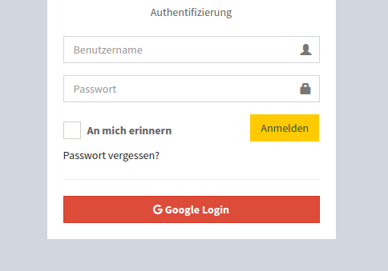

# silasjoisten/sonata-oauth2-login-bundle

[](https://travis-ci.org/silasjoisten/sonata-oauth2-login-bundle)

## Installation

```console
composer require silasjoisten/sonata-oauth2-login-bundle
```

Register the Bundle in **app/AppKernel.php**:
```php
 class AppKernel extends Kernel
 {
     public function registerBundles()
     {
        // ..
        new HWI\Bundle\OAuthBundle\HWIOAuthBundle(),
        new SilasJoisten\Sonata\Oauth2LoginBundle\SonataOauth2LoginBundle(),
        // ..
     }

    // ..
}
```

## Configuration

### Include the Routing:
```yml
SonataOauth2LoginBundle:
    resource: "@SonataOauth2LoginBundle/Resources/config/routing.xml"
```

### Configure the Bundle:
```yml
sonata_oauth2_login:
    valid_email_domains: ["@your-domain.com"]
    default_user_roles: ["ROLE_SONATA_ADMIN"]
```

_You can add as much valid domains as you want_

### Configure the HWIOauthBundle:

```yml
# app/config/security.yml

security:
   providers:
      hwi:
         id: sonata_oauth2_login.user.provider

         #...

   firewalls:
      YOUR_FIREWALL:
         #pattern: /admin(.*) REMOVE THIS LINE IF YOU ARE USING SONATA ADMIN
         oauth:
            resource_owners:
               google:         "/login/check-google"
            login_path:        /admin/login                 # For Sonata Admin
            use_forward:       false
            default_target_path: /admin/dashboard           # For Sonata Admin
            failure_path:      /admin/login                 # For Sonata Admin
            oauth_user_provider:
               service:  sonata_oauth2_login.user.provider
```

```yml
# app/config/config.yml

hwi_oauth:
    firewall_names: [YOUR_FIREWALL]
    resource_owners:
        google:
            type:                "google"
            client_id:           "YOUR_CLIENT_ID"
            client_secret:       "YOUR_CLIENT_SECRET"
            scope:               "email profile"
            options:
                csrf: true
                access_type:     offline
```

## Usage

To use the OAuth2 login you just need to call the Twig function to render the button in your login template like this:


```twig
{{ render_login_button() }}
```

Optional: You can pass an *array* inside to to set custom *class* and *value*

## Look and Feel

